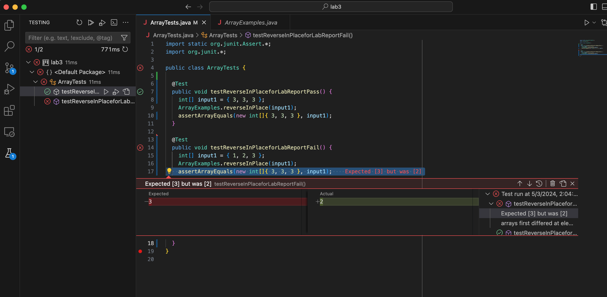

```
public class ArrayTests {

  @Test 
	public void testReverseInPlaceforLabReportPass() {
    int[] input1 = { 3, 3, 3 };
    ArrayExamples.reverseInPlace(input1);
    assertArrayEquals(new int[]{ 3, 3, 3 }, input1);
	}

  @Test 
	public void testReverseInPlaceforLabReportFail() {
    int[] input1 = { 1, 2, 3 };
    ArrayExamples.reverseInPlace(input1);
    assertArrayEquals(new int[]{ 3, 2, 1 }, input1);
	}
}
```

**Code Before Bug Fixed:**
```
public class ArrayExamples {

  // Changes the input array to be in reversed order
  static void reverseInPlace(int[] arr) {
    for(int i = 0; i < arr.length; i += 1) {
      arr[i] = arr[arr.length - i - 1];
    }
  }
}
```
**Code After Bug Fixed**
```
public class ArrayExamples {

  // Changes the input array to be in reversed order
  static void reverseInPlace(int[] arr) {
    int left = 0;
    int right = arr.length - 1;
    while (left < right) {
      int temp = arr[left];
      arr[left] = arr[right];
      arr[right] = temp;
      left++;
      right--;
    }
  }
}
```
**Why did this fix work**
The code that was their before was wrong because it would iterate through the array from left to right and then change the first element to match the last element and then the second element to match the second to last element, ect, but this is wrong as when we past half the legnth for value of arr.legnth, then we are turning the second half elements into the first half element, but because the first half elements have already turned into the last half elements, then we are just copying over the second half elements for the first and second half rather than acutally reversing it. The newly implimented code works because first we are declaring a left and right number with the left being set on the first element in the array and then the right being set on the last element on the array. Then while left is less than right, or while we haven't passed the middle of the array, we will initiate a temp variable that will hold the value of the left pointer an dthen we will then set the left element into the right element and then the right element into the temp left element. We then will iterate the left pointer one to the right and then the right pointer one to the left will the while loop is false.

**Input:**
```
grep -r "2024" ./technical > output.txt
```
**Output:**
./technical/government/Gen_Account_Office/d01591sp.txt:begins to decline. By 2024, gross national saving as a share of GDP
./technical/biomed/cc350.txt:        (Pulsiocath 2024 L, Pulsion, Munich, Germany) and 24 h
**Explaination**
The grep -r "2024"./technical > output.txt command does a recursive search for the string "2024" across all files located in the `./technical` directory, redirecting the results to the `output.txt file. This command is helpful for locating instances of a certain string across several files and directories, such as a specified year or any other pattern. It is possible to conduct additional analysis or document the search results by saving the output to a file.

**Input**
```
grep -r "California" ./technical > output.txt
```
**Output:**
./technical/government/About_LSC/Progress_report.txt:Texas, Missouri, California, and Indiana who are actively and
./technical/government/About_LSC/Progress_report.txt:conferences in Alabama, Arkansas, California, Colorado,
./technical/government/About_LSC/Progress_report.txt:three years. Arizona, Arkansas, California, Illinois, Kentucky, New
./technical/government/About_LSC/Progress_report.txt:In 2001, California held its largest meeting of legal services
./technical/government/About_LSC/Progress_report.txt:California's Access to Justice Commission, Legal Aid Association
./technical/government/About_LSC/Progress_report.txt:In 2001, California followed the lead of other states (New
./technical/government/About_LSC/Progress_report.txt:service throughout the state. In California, there are 102 legal
./technical/government/About_LSC/Progress_report.txt:LSC-funded. California's planning and collaborative efforts in the
./technical/government/About_LSC/Progress_report.txt:Association of California (LAAC) is a membership organization of
./technical/government/About_LSC/Progress_report.txt:Clearinghouse. It is the entity in California responsible for state
./technical/government/About_LSC/Strategic_report.txt:delivery system. Programs in California, Illinois, Kentucky,
./technical/government/About_LSC/Strategic_report.txt:Post-reconfiguration Visits. Occurred in California,
./technical/government/About_LSC/Strategic_report.txt:Orange County, California to expand the I-CAN!
./technical/government/About_LSC/Strategic_report.txt:County, California to the Virginia Court System. We also organized
./technical/government/About_LSC/Strategic_report.txt:people - whether they are California farm workers, small farmers in
./technical/government/About_LSC/Comments_on_semiannual.txt:1 California, Colorado, Florida, Illinois, Indiana, Maine,
./technical/government/About_LSC/commission_report.txt:University, Stanford, California on April 10, 1999. All requests to
./technical/government/About_LSC/commission_report.txt:Mark Schacht, California Rural Legal Assistance Foundation)
./technical/government/About_LSC/commission_report.txt:Testimony at 15 (testimony of Cynthia Rice, California Rural Legal
./technical/government/About_LSC/commission_report.txt:(comment of Jose Padilla and Cynthia L. Rice, California Rural
./technical/government/About_LSC/commission_report.txt:(testimony of Cynthia Rice, California Rural Legal Assistance).
./technical/government/About_LSC/commission_report.txt:California Rural Legal Assistance); March Comments at 225 (comment
./technical/government/About_LSC/commission_report.txt:of Jose Padilla and Cynthia L. Rice, California Rural Legal
./technical/government/About_LSC/commission_report.txt:April Testimony at 10 (testimony of Cynthia Rice, California Rural
./technical/government/About_LSC/commission_report.txt:California Rural Legal Assistance).
./technical/government/About_LSC/commission_report.txt:California Rural Legal Assistance). Many aliens who became lawful
./technical/government/About_LSC/commission_report.txt:California Rural Legal Assistance); March Testimony at 116
./technical/government/About_LSC/commission_report.txt:Testimony at 28 (testimony of Cynthia Rice, California Rural Legal
./technical/government/About_LSC/commission_report.txt:of Victor Lara, Attorney at Law). Forestry workers in California
./technical/government/About_LSC/commission_report.txt:may spend April to October in remote parts of California and then
./technical/government/About_LSC/commission_report.txt:(comment of Jose Padilla and Cynthia L. Rice, California Rural
./technical/government/About_LSC/commission_report.txt:North Carolina). Attorneys at California Rural Legal Assistance
./technical/government/About_LSC/commission_report.txt:Rice, California Rural Legal Assistance). The National Agricultural
./technical/government/About_LSC/commission_report.txt:California farmworker is employed 6-9 months per year and earns
./technical/government/About_LSC/commission_report.txt:of Jose Padilla and Cynthia L. Rice, California Rural Legal
./technical/government/About_LSC/commission_report.txt:Testimony at 15 (testimony of Cynthia Rice, California Rural Legal
./technical/government/About_LSC/commission_report.txt:Rice, California Rural Legal Assistance); April Testimony at 91-97
./technical/government/About_LSC/commission_report.txt:205 (comment of Jose Padilla and Cynthia L. Rice, California Rural
./technical/government/About_LSC/commission_report.txt:California Rural Legal Assistance). Further, when recruitment
./technical/government/About_LSC/commission_report.txt:California Rural Legal Assistance). A farmworker may need legal
./technical/government/About_LSC/commission_report.txt:Cynthia L. Rice, California Rural Legal Assistance).
./technical/government/About_LSC/commission_report.txt:eligibility. See id. Unemployment compensation claims in California
./technical/government/About_LSC/commission_report.txt:California Rural Legal Assistance).
./technical/government/About_LSC/commission_report.txt:of Jose Padilla and Cynthia L. Rice, California Rural Legal
./technical/government/About_LSC/commission_report.txt:Rice, California Rural Legal Assistance); March Comments at 247
./technical/government/About_LSC/commission_report.txt:April Testimony at 19 (testimony of Cynthia Rice, California Rural
./technical/government/About_LSC/commission_report.txt:Migrant Legal Assistance Project). In California, cases in the
./technical/government/About_LSC/commission_report.txt:Jose Padilla and Cynthia L. Rice, California Rural Legal
./technical/government/About_LSC/commission_report.txt:California Rural Legal Assistance); April Testimony at 139
./technical/government/About_LSC/commission_report.txt:California Rural Legal Assistance); April Testimony at 78
./technical/government/About_LSC/commission_report.txt:California Rural Legal Assistance). Farmworkers' long and
./technical/government/About_LSC/commission_report.txt:California Rural Legal Assistance); March Comments at 223 (comment
./technical/government/About_LSC/commission_report.txt:Attorney at Law). In California, even large labor rights cases are
./technical/government/About_LSC/commission_report.txt:California Rural Legal Assistance). Private attorneys are not
./technical/government/About_LSC/commission_report.txt:available to represent aliens in California administrative
./technical/government/About_LSC/commission_report.txt:Testimony at 18 (testimony of Cynthia Rice, California Rural Legal
./technical/government/About_LSC/commission_report.txt:Rice, California Rural Legal Assistance).
./technical/government/About_LSC/commission_report.txt:L. Rice, California Rural Legal Assistance); March Comments at 216
./technical/government/About_LSC/commission_report.txt:Jose Padilla and Cynthia L. Rice, California Rural Legal
./technical/government/About_LSC/commission_report.txt:California Rural Legal Assistance); March Comments at 236 (comment
./technical/government/About_LSC/commission_report.txt:California Rural Legal Assistance).
./technical/government/About_LSC/commission_report.txt:Jose Padilla and Cynthia L. Rice, California Rural Legal
./technical/government/About_LSC/commission_report.txt:Padilla and Cynthia L. Rice, California Rural Legal Assistance).
./technical/government/About_LSC/commission_report.txt:California, there are other costs which the alien must bear, such
./technical/government/About_LSC/commission_report.txt:at 205 (comment of Jose Padilla and Cynthia L. Rice, California
./technical/government/About_LSC/commission_report.txt:year period, the California Industrial Relations Department issued
./technical/government/About_LSC/commission_report.txt:Mark Schacht, California Rural Legal Assistance Foundation). The
./technical/government/About_LSC/commission_report.txt:April Testimony at 12 (testimony of Cynthia Rice, California Rural
./technical/government/About_LSC/commission_report.txt:April Testimony at 12, 17-18 (testimony of Cynthia Rice, California
./technical/government/About_LSC/commission_report.txt:Testimony at 12, 17-18 (testimony of Cynthia Rice, California Rural
./technical/government/About_LSC/commission_report.txt:Padilla and Cynthia L. Rice, California Rural Legal
./technical/government/About_LSC/commission_report.txt:Padilla and Cynthia L. Rice, California Rural Legal Assistance);
./technical/government/About_LSC/commission_report.txt:Rice, California Rural Legal Assistance). LSC-funded attorneys
./technical/government/About_LSC/commission_report.txt:California Rural Legal Assistance); March Testimony at 155-56
./technical/government/About_LSC/commission_report.txt:204 (comment of Jose Padilla and Cynthia L. Rice, California Rural
./technical/government/About_LSC/commission_report.txt:California Rural Legal Assistance). Even if withdrawal were
./technical/government/About_LSC/commission_report.txt:30 (testimony of Cynthia Rice, California Rural Legal Assistance);
./technical/government/About_LSC/commission_report.txt:See April Testimony at 30 (testimony of Cynthia Rice, California
./technical/government/About_LSC/commission_report.txt:California Rural Legal Assistance); April Testimony at 90
./technical/government/About_LSC/commission_report.txt:California to know whether a client, who has been working in the
./technical/government/About_LSC/commission_report.txt:California Rural Legal Assistance). Requiring the client to contact
./technical/government/About_LSC/commission_report.txt:of Jose Padilla and Cynthia L. Rice, California Rural Legal
./technical/government/About_LSC/commission_report.txt:(comment of Jose Padilla and Cynthia L. Rice, California Rural
./technical/government/About_LSC/commission_report.txt:California, the client's rights to representation would be lost in
./technical/government/About_LSC/commission_report.txt:(comment of Jose Padilla and Cynthia L. Rice, California Rural
./technical/government/About_LSC/commission_report.txt:Rice, California Rural Legal Assistance).
./technical/government/About_LSC/commission_report.txt:California Rural Legal Assistance); April Testimony at 21
./technical/government/About_LSC/commission_report.txt:(testimony of Cynthia Rice, California Rural Legal Assistance).
./technical/government/About_LSC/commission_report.txt:Padilla and Cynthia L. Rice, California Rural Legal
./technical/government/About_LSC/commission_report.txt:Cynthia L. Rice, California Rural Legal Assistance); March Comments
./technical/government/About_LSC/commission_report.txt:of Jose Padilla and Cynthia L. Rice, California Rural Legal
./technical/government/About_LSC/commission_report.txt:L. Rice, California Rural Legal Assistance); April Comments at 106
./technical/government/About_LSC/commission_report.txt:April Testimony at 22 (testimony of Cynthia Rice, California Rural
./technical/government/About_LSC/commission_report.txt:(testimony of Cynthia Rice, California Rural Legal Assistance).
./technical/government/About_LSC/commission_report.txt:April Testimony at 22 (testimony of Cynthia Rice, California Rural
./technical/government/About_LSC/commission_report.txt:Padilla and Cynthia L. Rice, California Rural Legal Assistance).
./technical/government/About_LSC/commission_report.txt:Rice, California Rural Legal Assistance). The North Carolina Farm
./technical/government/About_LSC/commission_report.txt:California Rural Legal Assistance Foundation). Because SAWS and
./technical/government/About_LSC/commission_report.txt:Testimony at 9 (testimony of Cynthia Rice, California Rural Legal
./technical/government/About_LSC/commission_report.txt:California Rural Legal Assistance); April Testimony at 21
./technical/government/About_LSC/commission_report.txt:(testimony of Cynthia Rice, California Rural Legal Assistance).
./technical/government/About_LSC/ONTARIO_LEGAL_AID_SERIES.txt:Vietnamese and Spanish immigrants in California - enforce their
./technical/government/About_LSC/State_Planning_Report.txt:In 1998, California in recognition of the state's size,
./technical/government/About_LSC/State_Planning_Report.txt:mergers, Legal Services of Northern California has been the sole
./technical/government/About_LSC/State_Planning_Report.txt:high-quality services to clients throughout northern California. In
./technical/government/About_LSC/State_Planning_Report.txt:The Central California Region. Five LSC-funded programs
./technical/government/About_LSC/State_Planning_Report.txt:previously served the central California region. Today, the region
./technical/government/About_LSC/State_Planning_Report.txt:is served by three LSC-funded providers--California Rural Legal
./technical/government/About_LSC/State_Planning_Report.txt:Assistance (CRLA), Central California Legal Services (CCLS) and
./technical/government/About_LSC/State_Planning_Report.txt:created the California Rural Justice Consortium, a planning entity
./technical/government/About_LSC/State_Planning_Report.txt:Legal Center of Southern California to provide centralized intake
./technical/government/About_LSC/State_Planning_Report.txt:with an active period within California's justice community. The
./technical/government/About_LSC/State_Planning_Report.txt:California legislature to obtain state funds to support the
./technical/government/About_LSC/State_Planning_Report.txt:California appropriated, for the first time, $10 million for legal
./technical/government/About_LSC/State_Planning_Report.txt:programs are leaders and active participants in California's plan
./technical/government/About_LSC/State_Planning_Report.txt:Process. California, Florida, Maine, Maryland, Minnesota, Missouri,
./technical/government/About_LSC/State_Planning_Report.txt:Bar Institution. California, Minnesota, Washington
./technical/government/About_LSC/State_Planning_Report.txt:Filing of Court Documents, Training of Judges. California, Maine,
./technical/government/About_LSC/State_Planning_Report.txt:Participation. California, Indiana, Maryland, New Hampshire, Ohio,
./technical/government/About_LSC/State_Planning_Report.txt:Campaign for State Funding. California, Colorado, Iowa,
./technical/government/About_LSC/State_Planning_Special_Report.txt:California and New Jersey, comprise multiple service areas and,
./technical/government/Env_Prot_Agen/section-by-section_summary.txt:California, Colorado, Idaho, Nevada, New Mexico, Oregon, Utah, and
./technical/government/Env_Prot_Agen/final.txt:South Coast Air Quality Management District in Southern California,
./technical/government/Env_Prot_Agen/final.txt:in national parks and wilderness areas in Southern California. In
./technical/government/Env_Prot_Agen/tech_sectiong.txt:created by California's experience -- where competition may
./technical/government/Env_Prot_Agen/bill.txt:under subpart 3 of part B, Arizona, California, Colorado,
./technical/government/Env_Prot_Agen/bill.txt:Arizona, California, Colorado,the Commonwealth of Northern Mariana
./technical/government/Env_Prot_Agen/tech_adden.txt:California, the Southwest, and the parts of the U.S.
./technical/government/Env_Prot_Agen/tech_adden.txt:the California based 7th day Adventist study (e.g. Abbey et al,
./technical/government/Env_Prot_Agen/tech_adden.txt:three broad regions of the country: California, the Southwest, and
./technical/government/Gen_Account_Office/Testimony_cg00010t.txt:federally owned Naval Petroleum Reserve at Elk Hills, California.
./technical/government/Gen_Account_Office/Sept27-2002_d02966.txt:2002, the BLM state director in California had completed 532
./technical/government/Gen_Account_Office/Sept27-2002_d02966.txt:California, requires each of his territory managers to present an
./technical/government/Gen_Account_Office/d01376g.txt:We also interviewed the former CIO of the state of California
./technical/government/Gen_Account_Office/d01376g.txt:California, 1991).
./technical/government/Gen_Account_Office/pe1019.txt:communities in Texas, Alabama, California, Georgia, and
./technical/government/Gen_Account_Office/pe1019.txt:six selected states (Arkansas, California, Florida, Indiana, New
./technical/government/Gen_Account_Office/pe1019.txt:York, and California). Work included obtaining views of
./technical/government/Gen_Account_Office/pe1019.txt:California 28,841
./technical/government/Gen_Account_Office/pe1019.txt:about 45 percent of all unfiled returns (California, Florida,
./technical/government/Gen_Account_Office/pe1019.txt:variable, New York (1 percent), California (3 percent), Ohio (6
./technical/government/Gen_Account_Office/pe1019.txt:California, Connecticut, Illinois, Indiana, Kentucky, Maryland,
./technical/government/Gen_Account_Office/pe1019.txt:University of California, Center for the Study of Evaluation,
./technical/government/Gen_Account_Office/pe1019.txt:Los Angeles: University of California, Center for the Study of
./technical/government/Gen_Account_Office/pe1019.txt:Los Angeles: University of California,
./technical/government/Gen_Account_Office/pe1019.txt:Berkeley, Calif.: University of California Press, 1973.*
./technical/government/Gen_Account_Office/pe1019.txt:County, California by the Emergency Jobs
./technical/government/Gen_Account_Office/gg96118.txt:California. On the basis of their comments and our continuing
./technical/government/Gen_Account_Office/og97045.txt:vehicle program based on the California program. The OTC consists
./technical/government/Gen_Account_Office/og97045.txt:California program, unless a state could show it could meet the
./technical/government/Gen_Account_Office/og97045.txt:EPA substantially harmonize federal and California motor vehicle
./technical/government/Gen_Account_Office/og97045.txt:increases) of the national program for states other than California
./technical/government/Gen_Account_Office/Testimony_d01609t.txt:California, Maryland, and Michigan-improved their oversight and
./technical/government/Media/water_fees.txt:result, Chris Schneider, executive director of Central California
./technical/government/Media/Legal-aid_chief.txt:California.
./technical/government/Media/Unusual_Woodburn.txt:by California Rural Legal Assistance. Irma Luna, a community worker
./technical/government/Media/Unusual_Woodburn.txt:Studies in California show that most Mixtecs follow the tomato,
./technical/government/Media/Few_who_need.txt:California Bar Journal
./technical/government/Media/Few_who_need.txt:California lags far behind comparable states in funding legal
./technical/government/Media/Few_who_need.txt:the California Commission on Access to Justice, which also found
./technical/government/Media/Few_who_need.txt:California has the highest number of people in poverty in the
./technical/government/Media/Few_who_need.txt:poor jumped 30 percent, occurred in California, and nearly 25
./technical/government/Media/Few_who_need.txt:Even those with jobs are suffering: 26 percent of California
./technical/government/Media/Few_who_need.txt:Justice in California," examined how the legal needs of the state's
./technical/government/Media/Few_who_need.txt:California to meet the poor's legal needs, Connecticut and
./technical/government/Media/Few_who_need.txt:from two to 14 times more proportionately than California, despite
./technical/government/Media/Few_who_need.txt:the fact that California has the world's sixth largest economy.
./technical/government/Media/Few_who_need.txt:the legal needs of low-income Californians.
./technical/government/Media/Few_who_need.txt:every 10,000 poor Californians. Despite this bleak picture, the
./technical/government/Media/Few_who_need.txt:injustice," observed Justice Earl Johnson of the California Court
./technical/government/Media/Few_who_need.txt:denied," said Londen. "Clearly, California can - and must - do
./technical/government/Media/Nonprofit_Buys.txt:California Rural Legal Assistance has purchased an Oxnard
./technical/government/Media/Nonprofit_Buys.txt:signals California Rural Legal Assistance's intention to establish
./technical/government/Media/Nonprofit_Buys.txt:Latino to serve on the California Supreme Court.
./technical/government/Media/Nonprofit_Buys.txt:California Rural Legal Assistance has provided legal services to
./technical/government/Media/Nonprofit_Buys.txt:California Rural Legal Assistance operations.
./technical/government/Media/Legal_hotline.txt:California, was the only California application from 24 submitted
./technical/government/Media/Legal_hotline.txt:screw-up in Washington that California is losing having a program
./technical/government/Media/Legal_hotline.txt:Northern California.
./technical/government/Media/Legal_hotline.txt:Chisorom Okwuosa, legal services developer for the California
./technical/government/Media/Workers_aid_center.txt:California. It will provide brochures, form letters seeking back
./technical/government/Media/Working_for_Free.txt:The State Bar of California presented Zucker with its 2002
./technical/government/Media/Kiosks_for_court_forms.txt:A University of California, Irvine, study released Wednesday
./technical/government/Media/Kiosks_for_court_forms.txt:should clear the way for expansion throughout California. Locally,
./technical/government/Media/Kiosks_for_court_forms.txt:Bonnie Hough, supervising attorney for the California Judicial
./technical/government/Media/Coup_Reshapes_Legal_Aid.txt:multimillion-dollar grant from the California Endowment to fund a
./technical/government/Media/Lockyer_Warns.txt:State Atty. Gen. Bill Lockyer is warning Californians to beware
./technical/government/Media/Lockyer_Warns.txt:"The true nonprofit legal services organizations in California
./technical/government/Media/Lockyer_Warns.txt:The judge determined that Moore had violated California's Unfair
./technical/government/Media/Assuring_Underprivileged.txt:and the State Bar of California's Statewide Bench-Bar
./technical/government/Media/Assuring_Underprivileged.txt:services in the state of California is immeasurable," said Patricia
./technical/government/Media/Assuring_Underprivileged.txt:State Bar of California - have honored her.
./technical/government/Media/Free_Legal_Assistance.txt:California are using computerized video kiosks to prepare common
./technical/government/Media/Free_Legal_Assistance.txt:more Californians are going to court without a lawyer.
./technical/government/Media/Free_Legal_Assistance.txt:The State Bar of California has characterized the trend as "the
./technical/government/Media/Farm_workers.txt:In 1998, Cesar Chavez fasted for 36 days in California to
./technical/government/Media/Farm_workers.txt:that California farmworkers face greater risk of pesticide
./technical/government/Media/Farm_workers.txt:migrant farm workers in California, most of them Hispanic, have a
./technical/government/Media/Farm_workers.txt:with that from the California Cancer Registry.
./technical/government/Media/Understanding.txt:California to anchor the hotline.
./technical/government/Media/Bridging_legal_aid_gap.txt:Lash is associate dean at the University of Southern California
./technical/government/Media/Bridging_legal_aid_gap.txt:Law School. Johnson is a justice on California's Second District
./technical/government/Media/Bridging_legal_aid_gap.txt:Court of Appeal. Lash and Johnson are co-chairs of the California
./technical/government/Media/Bridging_legal_aid_gap.txt:In her year-long odyssey through the California justice system,
./technical/government/Media/Bridging_legal_aid_gap.txt:Access to Justice in California," prepared by the California
./technical/government/Media/Bridging_legal_aid_gap.txt:million poor Californians whose basic civil legal needs -- often
./technical/government/Media/Bridging_legal_aid_gap.txt:California has a critical dearth of legal services for the poor,
./technical/government/Media/Bridging_legal_aid_gap.txt:resources so that all Californians, regardless of income, have
./technical/government/Media/Bridging_legal_aid_gap.txt:California does have a strong network of legal aid organizations
./technical/government/Media/Bridging_legal_aid_gap.txt:all Californians. In 1999, thanks to Gov. Gray Davis and leaders in
./technical/government/Media/Bridging_legal_aid_gap.txt:aid for the poor. In addition, California Supreme Court Chief
./technical/government/Media/Bridging_legal_aid_gap.txt:state government support in California is at $84.5 million on legal
./technical/government/Media/Bridging_legal_aid_gap.txt:Californians spend on lawyers each year -- and that 2 percent would
./technical/government/Media/Bridging_legal_aid_gap.txt:or triples that of California. And democratic governments
./technical/government/Media/Bridging_legal_aid_gap.txt:world, California should certainly be able to adequately fund free
./technical/government/Media/Bridging_legal_aid_gap.txt:that the goal of equal access to justice for all Californians is
./technical/government/Media/Bridging_legal_aid_gap.txt:restraining order. California can -and must -- do better.
./technical/plos/journal.pbio.0020419.txt:        Jolla, California. Francis began with the brightest young minds he could find.
./technical/plos/pmed.0020073.txt:          Avant, Applied Biosystems, Foster City, California, United States), based on a new NlaIII
./technical/plos/pmed.0020073.txt:          ligated into plasmids using the TOPO TA-cloning kit (Invitrogen, Carlsbad, California,
./technical/plos/pmed.0020073.txt:          (Stratagene, La Jolla, California, United States) and cloned into expression vectors as
./technical/plos/journal.pbio.0030024.txt:        Arthur Toga, a neuroscientist at the University of California, Los Angeles, and Allen Brain
./technical/plos/journal.pbio.0030024.txt:        neuroscientist at the California Institute of Technology in Pasadena, California, is in
./technical/plos/journal.pbio.0020145.txt:        interacting with investigators at the University of California, San Francisco, while taking
./technical/plos/pmed.0020103.txt:          N2 supplement (Invitrogen, Carlsbad, California, United States), 2 μg/ml heparin, 10
./technical/plos/pmed.0020103.txt:          ng/ml leukemia inhibitory factor (Chemicon, Temecula, California, United States), 20
./technical/plos/pmed.0020103.txt:          Carpinteria, California, United States); rabbit anti-Glut-2, 1:200 (ADI, San Antonio,
./technical/plos/pmed.0020103.txt:          optical slice thickness of 0.6 μm was performed on a Bio-Rad (Hercules, California,
./technical/plos/pmed.0020062.txt:        In Stockton, California, a city of 269,000 people nestled in California's largest
./technical/plos/pmed.0020062.txt:        California Endowment, (3) agencies and programs within the various states, such as the very
./technical/plos/pmed.0020060.txt:        successfully bigamous marriages in New York and California.
./technical/plos/pmed.0010028.txt:          of Southern California Institutional Review Board. Analysis of the patient samples was
./technical/plos/pmed.0010028.txt:          at the University of Southern California Norris Cancer Center (Los Angeles, California,
./technical/plos/pmed.0010028.txt:          isothiocyanate (Caltag Laboratories, Burlingame, California, United States) and
./technical/plos/pmed.0010028.txt:          CD19-CyChrome (BD Biosciences, Palo Alto, California, United States) Abs, and
./technical/plos/pmed.0010028.txt:          (TreeStar, San Carlos, California, United States).
./technical/plos/pmed.0010028.txt:            (GIBCO, San Diego, California, United States) before use. T2 cells were HLA-A2.1+ and
./technical/plos/pmed.0010028.txt:          Carlsbad, California, United States) and reverse-transcribed into cDNA using SuperScript
./technical/plos/pmed.0010028.txt:          real-time detection system (Bio-Rad, Hercules, California, United States) and a
./technical/plos/pmed.0010028.txt:          QuantiTect SYBR Green PCR kit (Qiagen, Valencia, California, United States). PCR
./technical/plos/pmed.0010028.txt:          Foster City, California, United States) and analyzed using GeneScan software (Applied
./technical/plos/pmed.0010028.txt:          A standard software package (SigmaPlot 5.0, Systat Software, Richmond, California,
./technical/plos/pmed.0020210.txt:        Park, California, United States. At least one compound from this series is entering
./technical/plos/pmed.0020210.txt:        in Parasitic Diseases at the University of California, San Francisco (UCSF). Here,
./technical/plos/journal.pbio.0020054.txt:        More than 750,000 acres (303,500 hectares) were burned in southern California alone
./technical/plos/journal.pbio.0020054.txt:        including in Southern California last summer. Maps of actual and predicted surface winds
./technical/plos/pmed.0010066.txt:          testing was performed using GraphPad Prism (GraphPad Software, San Diego, California,
./technical/plos/journal.pbio.0030050.txt:        important as its increase in size. Neurobiologist John Allman (California Institute of
./technical/plos/journal.pbio.0030050.txt:        Technology, Pasadena, California, United States) and his collaborators, for instance, have
./technical/plos/pmed.0010064.txt:          Virology and Immunology (San Francisco, California, United States) as previously
./technical/plos/pmed.0020160.txt:          Coulter, Fullerton, California, United States). Albumin was measured using the
./technical/plos/pmed.0020161.txt:          Diego, California, United States) was performed on a MoFlo (Cytomation, Fort Collins,
./technical/plos/pmed.0020161.txt:          and ALCAM(CD166) were from BD Biosciences Pharmingen (San Diego, California, United
./technical/plos/pmed.0020161.txt:          Polyclonal antibodies used were MyoD (Santa Cruz Biotechnology, Santa Cruz, California,
./technical/plos/pmed.0020161.txt:          human nuclear antigen (Chemicon, Temecula, California, United States).
./technical/plos/pmed.0020161.txt:            Valencia, California, United States). Total RNA (2 μg each) was reverse transcribed
./technical/plos/pmed.0020161.txt:            (SuperScript; Invitrogen, Carlsbad, California, United States). PCR conditions were
./technical/plos/pmed.0020161.txt:            (Santa Clara, California, United States) U133A human oligonucleotide arrays. Data were
./technical/plos/pmed.0020017.txt:          Valencia, California, United States), as per manufacturer's instructions. Use of this
./technical/plos/journal.pbio.0020440.txt:        California's agricultural station in Davis, re-examined the question, and found that, for
./technical/plos/pmed.0020162.txt:          Examination II, conducted in 1989–1990 in Oakland, California, United
./technical/plos/pmed.0020162.txt:          California Kaiser Permanente Medical Care Program. All participants resided in the San
./technical/plos/pmed.0020162.txt:          Program, Northern California Region, Institutional Review board; analyses for this
./technical/plos/pmed.0020002.txt:        C. posadasii , generically referred to as the “Californian” and
./technical/plos/pmed.0020002.txt:        “non-Californian” species respectively [1]. The fungus grows in a mycelial phase (see Box
./technical/plos/pmed.0020002.txt:        Arizona, New Mexico, and much of central and southern California (Figure 1).
./technical/plos/pmed.0020002.txt:        the disease has increased in California and Arizona, which may be partially due to the
./technical/plos/journal.pbio.0030105.txt:        at the University of California at Berkeley, it brought together a typically motley
./technical/plos/journal.pbio.0030105.txt:        The psychologist Paul Ekman (University of California at San Francisco) brought the
./technical/plos/pmed.0020018.txt:          California, United States). Streptavidin-antibody HRP-conjugated C-Myc antibody 9E10,
./technical/plos/pmed.0020018.txt:          Minnesota, United States). N2 supplement was obtained from Gibco (Carlsbad, California,
./technical/plos/pmed.0020018.txt:          Diego, California, United States). Protein concentration assay kit was purchased from
./technical/plos/pmed.0020018.txt:          Biorad (Hercules, California, United States). LIVE/DEAD Viability/Cytotoxicity Assay Kits
./technical/plos/pmed.0010045.txt:          overnight equilibration with macrophage serum-free medium (GIBCO, San Diego, California,
./technical/plos/pmed.0010045.txt:          United States; Invitrogen, Carlsbad, California, United States) supplemented with 5 ng/ml
./technical/plos/pmed.0010045.txt:          (Calbiochem, San Diego, California, United States), and TNFα (R&D Systems,
./technical/plos/pmed.0010045.txt:          RNA was isolated using RNeasy Mini Kit (Qiagen, Valencia, California, United States),
./technical/plos/pmed.0010045.txt:          City, California, United States). Real-time PCR was performed using Taqman Universal
./technical/plos/journal.pbio.0020073.txt:        nanotechnology. This lecture, presented to the American Physical Society at the California
./technical/plos/journal.pbio.0020113.txt:        Jolla, California, United States).
./technical/plos/journal.pbio.0020113.txt:        Research Institute (Moss Landing, California, United States), recently demonstrated that
./technical/plos/journal.pbio.0020113.txt:        California, Santa Barbara (Santa Barbara, California, United States), demonstrated that the
./technical/plos/journal.pbio.0020064.txt:        field, including collaborators Charles Zuker (University of California, San Diego [UCSD],
./technical/plos/journal.pbio.0020064.txt:        La Jolla, California, United States) and Nick Ryba (National Institute of Dental and
./technical/plos/pmed.0010056.txt:        such as the University of California at San Francisco's Tropical Disease Research Unit (San
./technical/plos/pmed.0010056.txt:        Francisco, California, United States) show that even relatively modest computing,
./technical/plos/pmed.0010042.txt:        an industry trade magazine [2]. Amgen is the Californian biotech firm that hired handsome
./technical/plos/journal.pbio.0020306.txt:        California, United States), who is using scanning electron microscopy to examine diatom
./technical/plos/journal.pbio.0020306.txt:        Diego, California, United States) is a member of a collaborative project trying to develop
./technical/plos/journal.pbio.0020306.txt:        Creek, California, comes in.
./technical/plos/journal.pbio.0030129.txt:        (University of California, United States) for 
./technical/plos/journal.pbio.0020267.txt:        Neuropsychiatric Institute of the University of California at Los Angeles (UCLA) (Los
./technical/plos/journal.pbio.0020267.txt:        Angeles, California, United States).
./technical/plos/journal.pbio.0020267.txt:        the University of California at Davis Medical Center in Sacramento (California, United
./technical/plos/journal.pbio.0020267.txt:        neuroscientist at San Diego State University (San Diego, California, United States) sees a
./technical/plos/journal.pbio.0020267.txt:        Eric Courchesne and colleagues at University of California, San Diego (San Diego,
./technical/plos/journal.pbio.0020267.txt:        California, United States) hypothesized that brain overgrowth must occur earlier, before
./technical/plos/journal.pbio.0020267.txt:        UCLA (Los Angeles, California, United States), says these methods would be alien to, and
./technical/plos/journal.pbio.0020267.txt:        California, United States) and the National Alliance for Autism Research (Princeton, New
./technical/plos/pmed.0020118.txt:        medical schools of the University of Cambridge and University of California at San
./technical/plos/pmed.0020045.txt:          anti-CD36 antibody, clone FA 6–152 (IgG) (Immunotech, Fullerton, California, United
./technical/plos/pmed.0020045.txt:          States), clone SMO (IgM) (Santa Cruz Biotechnology, Santa Cruz, California, United
./technical/plos/pmed.0020045.txt:          anti-aquaporin1, anti-aquaporin2, anti-Na/K/2Cl (Chemicon, Temecula, California, United
./technical/plos/pmed.0020045.txt:          (Biosource, Camarillo, California, United States), and mouse monoclonal anti-tubulin
./technical/plos/journal.pbio.0020148.txt:        Developmental geneticist Didier Stainier (University of California, San Francisco,
./technical/plos/journal.pbio.0020148.txt:        California, United States) is also using zebrafish to study organ development, in
./technical/plos/journal.pbio.0020028.txt:        Pharmaceuticals in Carlsbad, California, is used to treat cytomegalovirus infections in the
./technical/plos/journal.pbio.0020028.txt:        Biology at City of Hope Hospital in Duarte, California, who has worked on RNA-based
./technical/plos/pmed.0010036.txt:          Viral RNA Mini Kit (Qiagen, Valencia, California, United States) according to the
./technical/plos/journal.pbio.0020213.txt:        In July 2000, the finger of blame for a mysterious mass killer of Californian oak trees
./technical/plos/journal.pbio.0020213.txt:        of thousands of oak trees across the coastal counties of California, is now present in at
./technical/plos/journal.pbio.0020213.txt:        Department of Energy's Joint Genome Project based in Walnut Creek, California. The focus
./technical/plos/journal.pbio.0020213.txt:        P. ramorum , which in 2002 netted the Virginia–California
./technical/plos/journal.pbio.0020213.txt:        Adjunct Professor of Mycology and Forest Pathology at the University of California at
./technical/plos/journal.pbio.0020213.txt:        Berkeley (Berkeley, California, United States), has spent a significant part of his working
./technical/plos/journal.pbio.0020213.txt:        native Californian forest (Box 2).
./technical/plos/journal.pbio.0020213.txt:        beeches, it could potentially mirror what's happening in California,’ he warns.
./technical/plos/journal.pbio.0020213.txt:        responsible for Californian SOD, there was speculation that 
./technical/plos/journal.pbio.0020213.txt:        Garbelotto has plenty on his plate in his battle against the Californian SOD. ‘I am not
./technical/plos/pmed.0010021.txt:        Duarte, California, it was entrapped in red cell membranes coated with antibody in an
./technical/plos/pmed.0010008.txt:          separation technique (autoMACS, Miltenyi Biotec, Auburn, California, United States).
./technical/plos/pmed.0010008.txt:          Diego, California, United States): FITC-, Cy5-, and PE-conjugated anti-CD4, -CD8, -CD3,
./technical/plos/pmed.0010008.txt:          (Applied Biosystems, Foster City, California, United States) as described previously
./technical/plos/pmed.0010008.txt:          immunoperoxidase protocol (Vectastain Elite, Vector Labs, Burlingame, California, United
./technical/plos/journal.pbio.0020172.txt:        including an annual peregrination to the California Institute of Technology, where I first
./technical/plos/journal.pbio.0020172.txt:        Fender, David Van Essen, and John Allman at the California Institute of Technology on the
./technical/plos/journal.pbio.0020012.txt:        mathematical modeller at the University of California at Santa Cruz. “Since 1840, life
./technical/plos/journal.pbio.0020012.txt:        Kenyon, professor of biochemistry and biophysics at the University of California at San
./technical/plos/journal.pbio.0020012.txt:        University of California at Davis and his research, on the effect on life expectancy of
./technical/biomed/1471-2121-3-10.txt:          (GraphPad Software, San Diego California USA,
./technical/biomed/cc991.txt:          7200ae (Puritan-Bennett, Carlsbad, California, USA).
./technical/biomed/cc991.txt:          Linda, California, USA) [ 12, 13]. VO 
./technical/biomed/1476-069X-2-4.txt:          Mexico, Florida, and California, a clear indication of
./technical/biomed/1472-6882-3-3.txt:          California, Irvine) between 2001 and 2002. A
./technical/biomed/1471-2407-2-3.txt:        California, Alaska, Washington, and Oregon). Our results
./technical/biomed/1471-2407-2-3.txt:        [ 39 ] in Northern California.
./technical/biomed/ar319.txt:          at the University of California, Santa Cruz
./technical/biomed/1476-4598-2-22.txt:          Dickinson, San Jose, CA) in the University of California,
./technical/biomed/gb-2002-4-1-r1.txt:          University of California Santa Cruz golden path server.
./technical/biomed/1471-2407-3-18.txt:        California, 41% of 197 community based organizations
./technical/biomed/1471-2415-3-5.txt:          (Invitrogen life technologies, Carlsbad, California) was
./technical/biomed/1472-6963-2-10.txt:          Competition in California in the 1980s: a case
./technical/biomed/1472-6963-2-10.txt:          California in 1982 offers a unique natural experiment to
./technical/biomed/1472-6963-2-10.txt:          other secular trends, the California legislation changed
./technical/biomed/1472-6963-2-10.txt:          During the same time period, California hospitals were
./technical/biomed/1472-6963-2-10.txt:          hospitals in California that were in operation during
./technical/biomed/1472-6963-2-10.txt:          Reports, filed annually by all California hospitals with
./technical/biomed/1472-6963-2-10.txt:            measures reported in the California Financial
./technical/biomed/1472-6963-2-10.txt:        changes in the nature of competition among California
./technical/biomed/1472-6963-2-10.txt:        located only in California during the 1980s. Can the
./technical/biomed/1472-6963-2-10.txt:        reductions that have been observed in California [ 20 ] and
./technical/biomed/1471-2458-3-5.txt:          Carlsbad, California). The PCR mixture contained 2 ×
./technical/biomed/1471-2458-3-5.txt:          California) and 10 μl of RT-PCR product in a final volume
./technical/biomed/1472-6882-3-1.txt:          California-Irvine [UCI]). A multi-disciplinary team of
./technical/biomed/1471-2466-3-1.txt:          California (Los Angeles, CA), Blood Centers of the
./technical/biomed/1471-2466-3-1.txt:          California San Francisco, San Francisco, CA, USA, has
./technical/biomed/1475-2875-2-14.txt:          (Affymetrix, Santa Clara, California), which contains
./technical/biomed/1475-2875-2-14.txt:          each treatment (Affymetrix, Santa Clara, California). AD
./technical/biomed/1472-6793-2-8.txt:          California, San Diego, Animal Subjects Committee. Female
./technical/biomed/1471-2458-3-2.txt:          Committee of the University of California at San
./technical/biomed/1471-2458-3-2.txt:          California. The San Francisco Department of Public Health
./technical/biomed/1471-213X-3-2.txt:          California).
./technical/biomed/1471-2458-2-16.txt:          dollars and they're doing it in California, and so that
./technical/biomed/gb-2003-4-2-r16.txt:          BLAT search at the University of California Santa Cruz
./technical/biomed/1471-2407-2-11.txt:          with NIH and University of California, San Francisco
./technical/biomed/1471-2164-3-28.txt:          California).
./technical/biomed/cc1498.txt:          Mesa, California, USA). Intra-assay coefficients of
./technical/biomed/bcr285.txt:          later modified at the University of Southern California
./technical/biomed/bcr285.txt:          later modified at the University of Southern California
./technical/biomed/1475-2867-3-12.txt:          California) which recognizes the influenza hemagglutinin
./technical/biomed/1476-072X-2-4.txt:            midpoint of the URE range from the California EPA [ 6 ]
./technical/biomed/1477-7827-1-48.txt:          software GraphPad Instat (San Diego, California, USA). P
./technical/biomed/1471-2229-1-3.txt:          Inc., Alameda, California, USA) were used as primers. DNA
./technical/biomed/1477-7827-1-9.txt:          approved by the University of California, San Diego
./technical/biomed/1471-2458-2-11.txt:          Alabama, California, Florida, New Hampshire, Ohio,
./technical/biomed/gb-2002-3-12-research0081.txt:        examples are the University of California Santa Cruz (UCSC)
./technical/biomed/1471-2164-3-10.txt:          Freeze of the University of California at Santa Cruz's
./technical/biomed/1471-2105-3-17.txt:        by Stanford University (California) researchers depositing
./technical/biomed/1471-2466-2-4.txt:          immunoblotting (BioRad Novapath, Hercules, California,
./technical/biomed/1471-2407-1-6.txt:          Ki-67 (DAKO, Carpinteria, California). IHC was performed
./technical/biomed/1475-2832-1-1.txt:          California participated in this study. Patients were
./technical/biomed/1475-2832-1-1.txt:        This work was supported by the State of California
./technical/biomed/1472-6963-3-11.txt:          Southern California.
./technical/biomed/1472-6874-2-13.txt:          California (Los Angeles, CA) in the Reproductive
./technical/biomed/1472-6874-2-13.txt:        in San Fernando, California and a Developmental Funds award
./technical/biomed/1477-7525-1-12.txt:        Angeles County, California. During the period examined for
./technical/biomed/1476-4598-2-2.txt:          Review Board at University of California, San Diego
./technical/biomed/1471-5945-3-3.txt:          of the University of California, Irvine, approved the
./technical/biomed/1471-2164-3-35.txt:          Facility of the University of California at Davis. They
./technical/biomed/1472-6963-3-12.txt:          states: Alaska, Arizona, California, Colorado, Hawaii,
./technical/biomed/gb-2000-1-1-research002.txt:          California, San Diego) and Gregory Delzoppo (Scripps
./technical/biomed/1476-4598-2-1.txt:          California San Diego, personal communication), although
./technical/biomed/rr37.txt:          from physician practices in Northern California. Details
./technical/biomed/rr37.txt:        California have not found an increased risk [ 5]. Other
./technical/biomed/1472-6963-3-1.txt:          legislation in the mid-1990s - including California's
./technical/biomed/1472-6963-3-1.txt:        enactment of PRWORA. Fourteen states (California,
./technical/biomed/1472-6963-3-1.txt:            1994 were California (18.4%), New York (10.9%), Florida
./technical/biomed/1472-6963-3-1.txt:            Mexico (23.5%), California (21.2%), Arizona (20.5%),
./technical/biomed/1472-6963-3-1.txt:            and Alabama (19.4%). Texas and California are also
./technical/biomed/1472-6963-3-1.txt:            foreign-born residents, although California did not
./technical/biomed/1472-6963-3-1.txt:            the United States), California and Illinois were the
./technical/biomed/1472-6963-3-1.txt:            residents - Texas (19%), California (18%), and New York
./technical/biomed/1472-6963-3-1.txt:            numbers of legal permanent residents (California,
./technical/biomed/1475-2875-2-4.txt:          Array (Affymetrix, Santa Clara, California), which
./technical/biomed/1475-2875-2-4.txt:          each treatment (Affymetrix, Santa Clara, California). AD
./technical/biomed/1472-6963-1-11.txt:        breast cancers seen in California among HMO enrollees
./technical/biomed/1472-6793-2-19.txt:          Manteca, California) with a beam diameter of 0.8 mm was
./technical/biomed/1472-6793-2-19.txt:          Reticon Corp., Sunnyvale, California). An amplifier was
./technical/biomed/bcr458.txt:        California, is distinguished among urban counties in the
./technical/biomed/bcr458.txt:        in California.
./technical/biomed/bcr458.txt:          Marin County and other California counties from the
./technical/biomed/bcr458.txt:          California Cancer Registry and the California Office of
./technical/biomed/bcr458.txt:          California Department of Finance [ 9 ] , we calculated
./technical/biomed/bcr458.txt:          California. The urban counties, which were defined as US
./technical/biomed/bcr458.txt:          of the SFBA and other urban counties in California. The
./technical/biomed/bcr458.txt:          in other parts of California, including other parts of
./technical/biomed/bcr458.txt:          California, and they were 28% higher than rates for other
./technical/biomed/bcr458.txt:          than in other urban California counties.
./technical/biomed/bcr458.txt:          than those for other urban California counties (119 cases
./technical/biomed/bcr458.txt:          cases per 100,000; 95% CI, 12-14; other urban California
./technical/biomed/bcr458.txt:          California between 1990 and 1999, Marin County rates
./technical/biomed/bcr458.txt:          California counties (Table 2). Among women age 45-64
./technical/biomed/bcr458.txt:          urban California counties.
./technical/biomed/bcr458.txt:        Marin County, California, have deviated markedly from those
./technical/biomed/bcr458.txt:        California [ 14 ] . In addition, 69% of all women aged
./technical/biomed/bcr458.txt:        1990-1998 compared with other parts of California [ 17 ] .
./technical/biomed/bcr458.txt:        widening difference between Marin County and California in
./technical/biomed/bcr458.txt:        the California Department of Finance population estimate
./technical/biomed/bcr458.txt:        and time [ 19 20 21 22 23 ] . Recent data from California
./technical/biomed/bcr458.txt:        not been observed in other parts of California and appears
./technical/biomed/gb-2003-4-8-r50.txt:        from the University of California at Santa Cruz (UCSC)
./technical/biomed/1471-2164-3-24.txt:          California Institute of Technology in the form of DNA
./technical/biomed/1471-2164-3-24.txt:        CITB California Institute of Technology BAC
./technical/biomed/bcr588.txt:          Cruz Biotechnology, Santa Cruz, California, USA).
./technical/biomed/bcr588.txt:          Histostain Plus kit (Zymed, San Francisco, California,
./technical/biomed/bcr588.txt:          (BioGenex, San Ramon, California, USA) after each
./technical/biomed/1471-2164-4-6.txt:          available from the University of California - Santa Cruz
./technical/biomed/1471-2164-4-6.txt:          California - Santa Cruz http://genome.ucsc.edu/ [ 36 ]
./technical/biomed/1478-1336-1-4.txt:          (University of California, San Francisco). VP16-RAR-LBD
./technical/biomed/1471-2105-3-2.txt:            Noller, University of California, Santa Cruz) and
./technical/biomed/1471-2105-3-2.txt:            of California, Santa Cruz). The PostScript files output
./technical/biomed/rr196.txt:          2.0 Kit (Invitrogen, Carlsbad, California) in accordance
./technical/biomed/rr196.txt:          Dynamics, Sunnyvale, California) with Image Quant
./technical/biomed/1471-2474-3-23.txt:        and Ray TFC; Surgical Dynamics Inc, Concord, California)
./technical/biomed/1471-2407-3-14.txt:        California of 17.2 and nationally of 23.2% [ 31 ] . This
./technical/biomed/1471-244X-3-5.txt:        California revealed that it was common for a resident of
./technical/biomed/1471-244X-3-5.txt:        summer months of July and August, in San Diego, California.
./technical/biomed/1471-2458-3-11.txt:        California Emerging Infections Program (CEIP) active
./technical/biomed/1471-2458-3-11.txt:        California counties. During the first year of active
./technical/biomed/1471-2458-3-11.txt:          Emerging Infections Program (EIP). The California EIP
./technical/biomed/1471-2458-3-11.txt:          Northern California counties in the San Francisco Bay
./technical/biomed/1471-2458-3-11.txt:          population of over six million people. The California
./technical/biomed/1471-2458-3-11.txt:          California, Berkeley; the California Department of Health
./technical/biomed/bcr605.txt:        California Cancer Center (NCCC) using census data suggested
./technical/biomed/bcr605.txt:          Research Corporation, both of San Francisco, California)
./technical/biomed/bcr605.txt:          The University of California, San Francisco, Committee
./technical/biomed/bcr605.txt:          Northwest (Washington, Oregon, and Nevada); California;
./technical/biomed/bcr605.txt:        However, the California Teachers Study cohort, with a
./technical/biomed/bcr605.txt:        similar to that observed for women in the California
./technical/biomed/bcr605.txt:        respectively) [ 16 ] and participants in the California
./technical/biomed/bcr605.txt:        ] , including a report from the California Teachers Study,
./technical/biomed/bcr605.txt:        CI = confidence interval; NCCC = Northern California
./technical/911report/chapter-13.4.txt:                chemistry, from California State University, Sacramento. Sufaat did not start on the
./technical/911report/chapter-13.4.txt:                reasons for sending Hazmi and Mihdhar to California do not seem especially
./technical/911report/chapter-13.4.txt:                explanation for the California destination. The possibility that the two hijackers
./technical/911report/chapter-13.4.txt:                addresses-one in the United States ("possibly in California") and one in South
./technical/911report/chapter-13.4.txt:                California." Intelligence report, interrogation of KSM, June 15, 2004.
./technical/911report/chapter-13.4.txt:                acclimate the hijackers to the United States, particularly San Diego, California."
./technical/911report/chapter-13.4.txt:                California, but Atta told him to discontinue this effort. Intelligence report,
./technical/911report/chapter-13.4.txt:                his training in California, see FBI report of investigation, interview of Adnan
./technical/911report/chapter-13.5.txt:            85. Hazmi and Mihdhar used their true names to obtain California driver's licenses
./technical/911report/chapter-3.txt:                California (UNOCAL) to build a pipeline across the country. While there was probably
./technical/911report/chapter-5.txt:                became the primary target. For similar reasons, California also became a target for
./technical/911report/chapter-5.txt:                headquarters, nuclear power plants, and the tallest buildings in California and the
./technical/911report/chapter-5.txt:                such as San Diego and Long Beach, California; brochures for schools; and airline
./technical/911report/chapter-6.txt:            One of the 16, Raed Hijazi, had been born in California to Palestinian parents; after
./technical/911report/chapter-6.txt:                spending his childhood in the Middle East, he had returned to northern California,
./technical/911report/chapter-6.txt:                that Hijazi had lived in California and driven a cab in Boston and that Deek was a
./technical/911report/chapter-7.txt:            Why Hazmi and Mihdhar came to California, we do not know for certain. Khalid Sheikh
./technical/911report/chapter-7.txt:                Mohammed (KSM), the organizer of the planes operation, explains that California was
./technical/911report/chapter-7.txt:                that al Qaeda had any agents in Southern California. We do not credit this
./technical/911report/chapter-7.txt:                California, so that they could begin pilot training as soon as possible. KSM claims
./technical/911report/chapter-7.txt:                Culver City, one of the most prominent mosques in Southern California.
./technical/911report/chapter-7.txt:                fellow inmates at a California prison in September- October 2003 that he had known
./technical/911report/chapter-7.txt:                rest of his time in California, until mid-December; he would then leave for Arizona
./technical/911report/chapter-7.txt:                Translating between English and Arabic, he assisted them in obtaining California
./technical/911report/chapter-7.txt:                of California declined to prosecute him on charges arising out of his alleged
./technical/911report/chapter-7.txt:                impression is that soon after arriving in California, Hazmi and Mihdhar sought out
./technical/911report/chapter-7.txt:                child arrived, he could stand life in California no longer. In late May and early
./technical/911report/chapter-7.txt:                California, and Arizona; and he briefly started at a couple of them before returning
./technical/911report/chapter-7.txt:                an English as a second language program in Oakland, California, which he had
./technical/911report/chapter-8.txt:                    California in the mid-1990s. A clandestine source said in 1998 that a Bin Ladin
./technical/911report/chapter-8.txt:            In June 2000, Mihdhar left California and returned to Yemen. It is possible that if,
./technical/911report/chapter-11.txt:                California went on the watch for his like.
**Explaination**
The grep -r "California"./technical > output.txt command does a recursive search for the string "California" across all files located in the `./technical` directory, redirecting the results to the `output.txt file. This command is helpful for locating instances of a certain string across several files and directories, such as a specified year or any other pattern. This essentially looks for everything that has California in it and then outputs it in the text file.

**Input:**
```
grep -i "pattern" ./technical/911report/chapter-1.txt
```
**Output:**
The FAA cleared the airspace. Radar data show that at 9:13, when the Otis fighters were about 115 miles away from the city, the fighters exited their holding pattern and set a course direct for Manhattan. They arrived at 9:25 and established a combat air patrol (CAP) over the city.
**Explaination:**
Here, the -i argument enables case-insensitivity in the search, enabling grep to match terms like "Pattern", "pattern", "PaTTern", and so on in the file chapter-1.txt located in the./technical directory. This is useful if you want to look for a pattern without being concerned about the search's case sensitivity.

**Input:**
```
grep -i "success" ./technical/911report/chapter-9.txt 
```
**Output**
                delays and were in some cases unsuccessful. Many calls were also prematurely
                debris, several officers entered the plaza and successfully rescued at least one
                company successfully rescued some civilians who were trapped on the 22nd floor as a
                successfully descended to the lobby, where another firefighter then persuaded them
                the Pentagon was mainly a success for three reasons: first, the strong professional
                evacuation was a success for civilians below the impact zone.
            First responders also played a significant role in the success of the evacuation.
                civilians trapped on the 22d floor of the North Tower, or the success of FDNY, PAPD,
            A separate matter is the varied success at conveying evacuation instructions to
                personnel in the North Tower after the South Tower's collapse. The success of NYPD
            The same three factors worked against successful communication among FDNY personnel.
**Explaination:**
This command searches chapter-9.txt for the word "success" without regard to case. It's useful if you want to locate instances of a term, capitalization or not.

**Input:**
```
find ./technical -type f -exec grep -l "pattern" {} \;
```
**Output:**
./technical/government/About_LSC/Strategic_report.txt
./technical/government/Env_Prot_Agen/multi102902.txt
./technical/government/Env_Prot_Agen/jeffordslieberm.txt
./technical/government/Env_Prot_Agen/ctf7-10.txt
./technical/government/Env_Prot_Agen/ctm4-10.txt
./technical/government/Env_Prot_Agen/atx1-6.txt
./technical/government/Env_Prot_Agen/bill.txt
./technical/government/Env_Prot_Agen/tech_adden.txt
./technical/government/Alcohol_Problems/Session3-PDF.txt
./technical/government/Alcohol_Problems/Session4-PDF.txt
./technical/government/Gen_Account_Office/d0269g.txt
./technical/government/Gen_Account_Office/Testimony_cg00010t.txt
./technical/government/Gen_Account_Office/pe1019.txt
./technical/government/Gen_Account_Office/d03273g.txt
./technical/government/Gen_Account_Office/d01591sp.txt
./technical/government/Gen_Account_Office/d02701.txt
./technical/government/Gen_Account_Office/Letter_WalkerJan30-2001.txt
./technical/government/Post_Rate_Comm/Mitchell_6-17-Mit.txt
./technical/government/Media/predatory_loans.txt
./technical/government/Media/Coup_Reshapes_Legal_Aid.txt
./technical/government/Media/Legal_Aid_attorney.txt
./technical/government/Media/Politician_Practices.txt
./technical/government/Media/Retirement_Has_Its_Appeal.txt
./technical/plos/pmed.0020059.txt
./technical/plos/journal.pbio.0020354.txt
./technical/plos/pmed.0020258.txt
./technical/plos/journal.pbio.0020140.txt
./technical/plos/journal.pbio.0020183.txt
./technical/plos/journal.pbio.0020394.txt
./technical/plos/journal.pbio.0020431.txt
./technical/plos/journal.pbio.0020035.txt
./technical/plos/pmed.0020073.txt
./technical/plos/journal.pbio.0030024.txt
./technical/plos/journal.pbio.0020019.txt
./technical/plos/pmed.0020103.txt
./technical/plos/pmed.0020117.txt
./technical/plos/journal.pbio.0020347.txt
./technical/plos/journal.pbio.0020420.txt
./technical/plos/pmed.0020102.txt
./technical/plos/journal.pbio.0020150.txt
./technical/plos/journal.pbio.0020146.txt
./technical/plos/journal.pbio.0020190.txt
./technical/plos/journal.pbio.0020147.txt
./technical/plos/pmed.0020238.txt
./technical/plos/journal.pbio.0020068.txt
./technical/plos/journal.pbio.0020054.txt
./technical/plos/pmed.0010066.txt
./technical/plos/pmed.0010067.txt
./technical/plos/journal.pbio.0030050.txt
./technical/plos/pmed.0020005.txt
./technical/plos/pmed.0020039.txt
./technical/plos/journal.pbio.0030127.txt
./technical/plos/pmed.0010064.txt
./technical/plos/pmed.0020216.txt
./technical/plos/journal.pbio.0020046.txt
./technical/plos/pmed.0020148.txt
./technical/plos/pmed.0020160.txt
./technical/plos/journal.pbio.0030137.txt
./technical/plos/pmed.0010061.txt
./technical/plos/journal.pbio.0020127.txt
./technical/plos/pmed.0020015.txt
./technical/plos/journal.pbio.0020125.txt
./technical/plos/journal.pbio.0020440.txt
./technical/plos/pmed.0020162.txt
./technical/plos/pmed.0020016.txt
./technical/plos/pmed.0020231.txt
./technical/plos/pmed.0020033.txt
./technical/plos/journal.pbio.0030105.txt
./technical/plos/journal.pbio.0020302.txt
./technical/plos/journal.pbio.0030065.txt
./technical/plos/journal.pbio.0020276.txt
./technical/plos/pmed.0020232.txt
./technical/plos/pmed.0020024.txt
./technical/plos/pmed.0020018.txt
./technical/plos/pmed.0020144.txt
./technical/plos/pmed.0020150.txt
./technical/plos/pmed.0010045.txt
./technical/plos/journal.pbio.0030062.txt
./technical/plos/journal.pbio.0020067.txt
./technical/plos/journal.pbio.0020310.txt
./technical/plos/journal.pbio.0020064.txt
./technical/plos/journal.pbio.0020306.txt
./technical/plos/pmed.0020180.txt
./technical/plos/pmed.0020194.txt
./technical/plos/pmed.0020235.txt
./technical/plos/pmed.0020209.txt
./technical/plos/journal.pbio.0020406.txt
./technical/plos/pmed.0020045.txt
./technical/plos/journal.pbio.0020215.txt
./technical/plos/pmed.0020247.txt
./technical/plos/journal.pbio.0020001.txt
./technical/plos/journal.pbio.0020439.txt
./technical/plos/journal.pbio.0020148.txt
./technical/plos/journal.pbio.0020216.txt
./technical/plos/journal.pbio.0020206.txt
./technical/plos/journal.pbio.0020164.txt
./technical/plos/pmed.0010036.txt
./technical/plos/journal.pbio.0020400.txt
./technical/plos/pmed.0020123.txt
./technical/plos/journal.pbio.0020213.txt
./technical/plos/pmed.0020257.txt
./technical/plos/pmed.0010008.txt
./technical/plos/journal.pbio.0020172.txt
./technical/plos/pmed.0020068.txt
./technical/biomed/1471-2350-4-3.txt
./technical/biomed/1471-2156-2-3.txt
./technical/biomed/1471-2156-3-11.txt
./technical/biomed/1471-2121-3-10.txt
./technical/biomed/1471-2172-3-4.txt
./technical/biomed/gb-2002-4-1-r2.txt
./technical/biomed/1471-2199-2-10.txt
./technical/biomed/1471-2202-2-9.txt
./technical/biomed/cc991.txt
./technical/biomed/1471-2369-3-9.txt
./technical/biomed/bcr620.txt
./technical/biomed/1476-069X-2-4.txt
./technical/biomed/1471-2164-2-9.txt
./technical/biomed/1471-2091-2-10.txt
./technical/biomed/gb-2001-2-4-research0010.txt
./technical/biomed/gb-2003-4-4-r24.txt
./technical/biomed/1471-213X-2-1.txt
./technical/biomed/1471-2156-4-5.txt
./technical/biomed/1471-2431-2-1.txt
./technical/biomed/1471-2180-2-22.txt
./technical/biomed/gb-2001-2-4-research0011.txt
./technical/biomed/bcr635.txt
./technical/biomed/gb-2003-4-5-r34.txt
./technical/biomed/1471-2202-2-8.txt
./technical/biomed/1471-2156-3-10.txt
./technical/biomed/1471-2458-3-20.txt
./technical/biomed/1471-2350-4-2.txt
./technical/biomed/1476-4598-1-8.txt
./technical/biomed/1476-0711-2-7.txt
./technical/biomed/1472-6947-3-8.txt
./technical/biomed/1471-2229-2-3.txt
./technical/biomed/gb-2002-3-9-research0043.txt
./technical/biomed/1471-2415-3-5.txt
./technical/biomed/gb-2001-2-7-research0025.txt
./technical/biomed/1476-069X-2-7.txt
./technical/biomed/1472-6890-2-5.txt
./technical/biomed/ar118.txt
./technical/biomed/gb-2002-3-7-research0032.txt
./technical/biomed/1471-2210-1-10.txt
./technical/biomed/1471-2202-4-10.txt
./technical/biomed/1472-6963-2-10.txt
./technical/biomed/1471-2156-4-6.txt
./technical/biomed/cc4.txt
./technical/biomed/1471-2180-2-35.txt
./technical/biomed/1471-2202-4-11.txt
./technical/biomed/gb-2001-2-4-research0012.txt
./technical/biomed/1471-2253-2-4.txt
./technical/biomed/gb-2001-2-7-research0024.txt
./technical/biomed/1471-2121-3-12.txt
./technical/biomed/1471-2148-1-8.txt
./technical/biomed/gb-2001-2-3-research0008.txt
./technical/biomed/gb-2003-4-7-r46.txt
./technical/biomed/1471-2288-2-4.txt
./technical/biomed/ar93.txt
./technical/biomed/bcr583.txt
./technical/biomed/1471-2156-3-17.txt
./technical/biomed/gb-2003-4-7-r42.txt
./technical/biomed/ar68.txt
./technical/biomed/1471-2172-3-2.txt
./technical/biomed/1471-2121-3-16.txt
./technical/biomed/1472-6750-1-12.txt
./technical/biomed/1472-6882-1-7.txt
./technical/biomed/1471-2377-2-4.txt
./technical/biomed/gb-2002-3-9-research0046.txt
./technical/biomed/rr74.txt
./technical/biomed/1476-069X-2-2.txt
./technical/biomed/1472-6793-2-8.txt
./technical/biomed/1471-2202-3-20.txt
./technical/biomed/1471-230X-2-21.txt
./technical/biomed/1476-4598-2-24.txt
./technical/biomed/gb-2001-2-11-research0046.txt
./technical/biomed/ar120.txt
./technical/biomed/1471-2407-1-19.txt
./technical/biomed/gb-2001-2-8-research0032.txt
./technical/biomed/gb-2002-3-7-research0036.txt
./technical/biomed/1471-2415-3-1.txt
./technical/biomed/gb-2003-4-5-r32.txt
./technical/biomed/rr171.txt
./technical/biomed/1471-2156-3-16.txt
./technical/biomed/gb-2003-4-7-r43.txt
./technical/biomed/ar297.txt
./technical/biomed/1471-2121-3-15.txt
./technical/biomed/gb-2003-4-5-r30.txt
./technical/biomed/gb-2002-3-9-research0051.txt
./technical/biomed/1471-2415-3-3.txt
./technical/biomed/gb-2002-3-9-research0045.txt
./technical/biomed/gb-2001-2-8-research0030.txt
./technical/biomed/bcr631.txt
./technical/biomed/cc3.txt
./technical/biomed/1471-2458-3-2.txt
./technical/biomed/1471-230X-2-23.txt
./technical/biomed/gb-2001-2-4-research0014.txt
./technical/biomed/1477-7819-1-10.txt
./technical/biomed/1471-2202-4-17.txt
./technical/biomed/bcr618.txt
./technical/biomed/gb-2002-3-7-research0035.txt
./technical/biomed/gb-2001-2-8-research0031.txt
./technical/biomed/1471-2148-2-17.txt
./technical/biomed/1471-2350-3-12.txt
./technical/biomed/gb-2002-3-9-research0044.txt
./technical/biomed/1471-2474-4-4.txt
./technical/biomed/1472-6823-3-1.txt
./technical/biomed/1471-2474-2-2.txt
./technical/biomed/rr172.txt
./technical/biomed/bcr284.txt
./technical/biomed/gb-2002-3-2-research0008.txt
./technical/biomed/gb-2002-3-11-research0059.txt
./technical/biomed/1471-213X-3-2.txt
./technical/biomed/1471-2148-3-18.txt
./technical/biomed/1471-2164-3-15.txt
./technical/biomed/1471-2164-3-29.txt
./technical/biomed/1475-925X-2-10.txt
./technical/biomed/1472-6807-3-1.txt
./technical/biomed/gb-2003-4-9-r58.txt
./technical/biomed/1471-2105-4-27.txt
./technical/biomed/1471-2407-2-11.txt
./technical/biomed/1471-2172-3-12.txt
./technical/biomed/gb-2003-4-6-r37.txt
./technical/biomed/1472-6750-1-8.txt
./technical/biomed/1471-244X-2-9.txt
./technical/biomed/gb-2002-3-12-research0085.txt
./technical/biomed/1471-213X-1-1.txt
./technical/biomed/cc1856.txt
./technical/biomed/1471-2180-3-15.txt
./technical/biomed/1471-2202-2-10.txt
./technical/biomed/1471-2180-1-8.txt
./technical/biomed/cc1498.txt
./technical/biomed/1471-2350-3-7.txt
./technical/biomed/gb-2002-3-2-research0009.txt
./technical/biomed/bcr285.txt
./technical/biomed/gb-2002-3-6-software0001.txt
./technical/biomed/1471-2407-3-3.txt
./technical/biomed/1471-2164-3-16.txt
./technical/biomed/1471-2091-3-18.txt
./technical/biomed/1471-2202-2-12.txt
./technical/biomed/1471-2164-4-23.txt
./technical/biomed/1471-2091-3-30.txt
./technical/biomed/1471-2164-3-9.txt
./technical/biomed/1471-2172-3-10.txt
./technical/biomed/1471-2172-2-4.txt
./technical/biomed/gb-2001-2-6-research0018.txt
./technical/biomed/1471-2105-2-9.txt
./technical/biomed/1472-6793-2-16.txt
./technical/biomed/1476-072X-2-4.txt
./technical/biomed/1471-2121-2-18.txt
./technical/biomed/1471-2105-4-24.txt
./technical/biomed/1471-2466-2-3.txt
./technical/biomed/1471-230X-3-5.txt
./technical/biomed/gb-2003-4-2-r14.txt
./technical/biomed/1472-6904-1-2.txt
./technical/biomed/1471-2105-4-25.txt
./technical/biomed/ar422.txt
./technical/biomed/gb-2001-2-10-research0042.txt
./technical/biomed/1471-2105-4-31.txt
./technical/biomed/ar387.txt
./technical/biomed/1471-2105-2-8.txt
./technical/biomed/1475-925X-2-12.txt
./technical/biomed/1478-7954-1-3.txt
./technical/biomed/1471-2164-3-8.txt
./technical/biomed/1471-2091-3-31.txt
./technical/biomed/gb-2002-3-12-research0086.txt
./technical/biomed/1471-2164-4-22.txt
./technical/biomed/1471-2458-2-6.txt
./technical/biomed/1477-7827-1-48.txt
./technical/biomed/1471-2229-1-3.txt
./technical/biomed/1471-213X-3-4.txt
./technical/biomed/1471-2431-3-4.txt
./technical/biomed/1471-213X-1-6.txt
./technical/biomed/1471-2164-4-26.txt
./technical/biomed/1471-2164-3-13.txt
./technical/biomed/1471-2202-2-17.txt
./technical/biomed/1472-6874-3-2.txt
./technical/biomed/ar778.txt
./technical/biomed/1471-2474-3-3.txt
./technical/biomed/1472-6785-2-6.txt
./technical/biomed/1471-2490-3-2.txt
./technical/biomed/1477-7827-1-9.txt
./technical/biomed/gb-2001-2-6-research0021.txt
./technical/biomed/1471-2407-2-16.txt
./technical/biomed/gb-2003-4-2-r11.txt
./technical/biomed/1471-2407-2-17.txt
./technical/biomed/1472-6815-2-3.txt
./technical/biomed/1471-2458-2-11.txt
./technical/biomed/1472-6785-2-7.txt
./technical/biomed/1472-6890-3-2.txt
./technical/biomed/ar792.txt
./technical/biomed/gb-2002-3-12-research0083.txt
./technical/biomed/1471-2180-3-13.txt
./technical/biomed/1471-2458-2-3.txt
./technical/biomed/1471-2431-3-5.txt
./technical/biomed/1472-6882-2-10.txt
./technical/biomed/1471-2350-3-1.txt
./technical/biomed/gb-2002-3-11-research0062.txt
./technical/biomed/1472-6882-2-5.txt
./technical/biomed/gb-2002-3-11-research0060.txt
./technical/biomed/cc303.txt
./technical/biomed/cc1477.txt
./technical/biomed/1471-2407-3-5.txt
./technical/biomed/cc1852.txt
./technical/biomed/1471-2164-4-25.txt
./technical/biomed/1471-2091-3-22.txt
./technical/biomed/1471-2202-2-14.txt
./technical/biomed/1471-2164-3-10.txt
./technical/biomed/1471-2121-2-22.txt
./technical/biomed/1472-6963-1-8.txt
./technical/biomed/1471-2156-3-4.txt
./technical/biomed/1471-2296-3-18.txt
./technical/biomed/1472-6920-2-1.txt
./technical/biomed/1476-072X-2-3.txt
./technical/biomed/ar140.txt
./technical/biomed/gb-2003-4-3-r17.txt
./technical/biomed/1472-6823-2-2.txt
./technical/biomed/1471-2172-2-3.txt
./technical/biomed/1471-2407-1-6.txt
./technical/biomed/1471-2164-4-24.txt
./technical/biomed/1471-213X-1-4.txt
./technical/biomed/1471-2180-3-10.txt
./technical/biomed/cc1476.txt
./technical/biomed/1471-2431-3-6.txt
./technical/biomed/bcr294.txt
./technical/biomed/gb-2002-3-11-research0061.txt
./technical/biomed/1477-7827-1-43.txt
./technical/biomed/1471-2202-1-1.txt
./technical/biomed/1471-2210-2-6.txt
./technical/biomed/1471-213X-1-9.txt
./technical/biomed/1471-2164-3-34.txt
./technical/biomed/1471-2164-4-15.txt
./technical/biomed/1471-2202-3-3.txt
./technical/biomed/1471-2202-2-18.txt
./technical/biomed/cc2358.txt
./technical/biomed/gb-2002-3-12-research0072.txt
./technical/biomed/1472-6963-3-6.txt
./technical/biomed/1477-7827-1-6.txt
./technical/biomed/1475-4924-1-10.txt
./technical/biomed/1471-2148-1-14.txt
./technical/biomed/1471-2210-2-14.txt
./technical/biomed/1471-2105-3-26.txt
./technical/biomed/1471-2407-2-18.txt
./technical/biomed/1471-2105-4-13.txt
./technical/biomed/gb-2003-4-1-r5.txt
./technical/biomed/1471-2156-2-12.txt
./technical/biomed/1471-2180-1-31.txt
./technical/biomed/1476-4598-2-2.txt
./technical/biomed/1472-684X-2-1.txt
./technical/biomed/1472-6963-3-7.txt
./technical/biomed/1475-2891-2-1.txt
./technical/biomed/1471-2091-2-5.txt
./technical/biomed/1475-4924-1-5.txt
./technical/biomed/1471-2164-4-14.txt
./technical/biomed/1471-2164-4-28.txt
./technical/biomed/bcr273.txt
./technical/biomed/1477-7827-1-54.txt
./technical/biomed/1471-2164-3-23.txt
./technical/biomed/ar774.txt
./technical/biomed/1476-511X-1-2.txt
./technical/biomed/1472-6963-3-12.txt
./technical/biomed/1471-2091-2-7.txt
./technical/biomed/1471-2180-1-33.txt
./technical/biomed/bcr45.txt
./technical/biomed/gb-2003-4-1-r7.txt
./technical/biomed/1471-2334-2-26.txt
./technical/biomed/1471-2121-2-11.txt
./technical/biomed/1471-5945-1-3.txt
./technical/biomed/1471-2105-3-18.txt
./technical/biomed/1477-7525-1-10.txt
./technical/biomed/gb-2002-3-5-research0024.txt
./technical/biomed/1471-2105-3-30.txt
./technical/biomed/1471-2407-2-33.txt
./technical/biomed/gb-2002-3-5-research0025.txt
./technical/biomed/1471-2261-3-4.txt
./technical/biomed/1471-2199-3-3.txt
./technical/biomed/1471-2121-2-10.txt
./technical/biomed/1471-2261-1-6.txt
./technical/biomed/gb-2003-4-3-r18.txt
./technical/biomed/ar615.txt
./technical/biomed/1476-4598-2-1.txt
./technical/biomed/1471-2180-1-26.txt
./technical/biomed/1472-6963-3-13.txt
./technical/biomed/1471-2202-3-1.txt
./technical/biomed/1471-2199-3-10.txt
./technical/biomed/1475-9268-1-1.txt
./technical/biomed/gb-2001-2-2-research0004.txt
./technical/biomed/1472-6750-3-4.txt
./technical/biomed/1471-2202-3-5.txt
./technical/biomed/1471-2164-4-13.txt
./technical/biomed/1471-2091-3-14.txt
./technical/biomed/1471-2164-3-32.txt
./technical/biomed/1471-2164-3-26.txt
./technical/biomed/1472-6750-1-6.txt
./technical/biomed/gb-2003-4-6-r39.txt
./technical/biomed/1471-2458-2-25.txt
./technical/biomed/gb-2003-4-3-r20.txt
./technical/biomed/gb-2003-4-9-r57.txt
./technical/biomed/1471-2105-4-28.txt
./technical/biomed/gb-2002-3-5-research0021.txt
./technical/biomed/ar407.txt
./technical/biomed/1475-925X-2-1.txt
./technical/biomed/1475-2867-3-3.txt
./technical/biomed/gb-2002-3-5-research0020.txt
./technical/biomed/1471-2121-2-15.txt
./technical/biomed/1471-2091-4-5.txt
./technical/biomed/gb-2001-3-1-research0001.txt
./technical/biomed/1471-2458-2-18.txt
./technical/biomed/1471-2164-3-4.txt
./technical/biomed/1471-2164-3-33.txt
./technical/biomed/1471-2091-3-15.txt
./technical/biomed/1471-2350-2-11.txt
./technical/biomed/1471-2164-3-19.txt
./technical/biomed/gb-2002-3-12-research0088.txt
./technical/biomed/gb-2002-3-12-research0077.txt
./technical/biomed/1471-2164-3-6.txt
./technical/biomed/gb-2003-4-8-r51.txt
./technical/biomed/1472-6793-2-19.txt
./technical/biomed/1471-2148-2-7.txt
./technical/biomed/1471-2105-3-22.txt
./technical/biomed/bcr317.txt
./technical/biomed/1471-2105-3-23.txt
./technical/biomed/bcr458.txt
./technical/biomed/1471-2105-3-37.txt
./technical/biomed/gb-2002-3-5-research0023.txt
./technical/biomed/1472-6793-2-18.txt
./technical/biomed/gb-2002-3-6-research0029.txt
./technical/biomed/1471-2164-3-7.txt
./technical/biomed/1471-2164-3-24.txt
./technical/biomed/1471-2164-3-18.txt
./technical/biomed/1472-6750-3-6.txt
./technical/biomed/1471-213X-1-15.txt
./technical/biomed/cc350.txt
./technical/biomed/bcr588.txt
./technical/biomed/1471-2199-2-2.txt
./technical/biomed/1475-2867-2-7.txt
./technical/biomed/1468-6708-3-4.txt
./technical/biomed/1471-2121-3-25.txt
./technical/biomed/1471-2202-4-6.txt
./technical/biomed/1472-6882-1-10.txt
./technical/biomed/1471-2121-3-19.txt
./technical/biomed/gb-2002-3-9-research0049.txt
./technical/biomed/1471-2180-2-1.txt
./technical/biomed/1471-2210-1-7.txt
./technical/biomed/1471-2180-2-16.txt
./technical/biomed/1471-213X-2-8.txt
./technical/biomed/1472-6793-1-12.txt
./technical/biomed/1471-2164-2-1.txt
./technical/biomed/1471-2202-2-1.txt
./technical/biomed/1471-2229-2-8.txt
./technical/biomed/1471-2121-3-30.txt
./technical/biomed/1471-2199-2-3.txt
./technical/biomed/1476-4598-1-3.txt
./technical/biomed/1477-7827-1-21.txt
./technical/biomed/1477-7827-1-23.txt
./technical/biomed/1471-2105-1-1.txt
./technical/biomed/gb-2002-3-10-research0052.txt
./technical/biomed/1471-2202-4-5.txt
./technical/biomed/1471-2164-4-5.txt
./technical/biomed/gb-2003-4-2-r9.txt
./technical/biomed/1471-2202-2-3.txt
./technical/biomed/1472-6793-2-4.txt
./technical/biomed/1471-2210-1-4.txt
./technical/biomed/1471-2121-4-2.txt
./technical/biomed/gb-2002-3-4-research0019.txt
./technical/biomed/1471-2202-3-10.txt
./technical/biomed/1472-6793-1-11.txt
./technical/biomed/1476-4598-2-28.txt
./technical/biomed/1471-2121-4-3.txt
./technical/biomed/1472-6793-2-5.txt
./technical/biomed/1471-2164-2-2.txt
./technical/biomed/gb-2001-2-12-research0054.txt
./technical/biomed/1471-2202-2-2.txt
./technical/biomed/gb-2003-4-2-r8.txt
./technical/biomed/1471-2105-3-2.txt
./technical/biomed/1471-2229-2-11.txt
./technical/biomed/1471-2164-4-4.txt
./technical/biomed/1471-2148-1-1.txt
./technical/biomed/1472-6882-1-12.txt
./technical/biomed/gb-2002-3-10-research0053.txt
./technical/biomed/1471-2148-3-3.txt
./technical/biomed/1471-2148-3-7.txt
./technical/biomed/1471-213X-1-13.txt
./technical/biomed/gb-2002-3-3-research0012.txt
./technical/biomed/1471-2156-3-22.txt
./technical/biomed/gb-2000-1-2-research0003.txt
./technical/biomed/1471-2105-3-6.txt
./technical/biomed/1471-2474-3-23.txt
./technical/biomed/1471-2407-3-14.txt
./technical/biomed/1471-2202-2-6.txt
./technical/biomed/1472-6793-2-1.txt
./technical/biomed/gb-2002-3-8-research0039.txt
./technical/biomed/1471-2369-3-6.txt
./technical/biomed/1471-2180-2-7.txt
./technical/biomed/1471-2164-2-6.txt
./technical/biomed/1471-2210-3-3.txt
./technical/biomed/1471-2121-4-6.txt
./technical/biomed/1471-2164-2-7.txt
./technical/biomed/gb-2001-2-12-research0051.txt
./technical/biomed/gb-2002-3-8-research0038.txt
./technical/biomed/1471-2407-3-15.txt
./technical/biomed/1471-2121-3-22.txt
./technical/biomed/1471-2148-1-4.txt
./technical/biomed/bcr570.txt
./technical/biomed/gb-2002-3-10-research0056.txt
./technical/biomed/1472-6947-3-5.txt
./technical/biomed/cc343.txt
./technical/biomed/1471-2148-3-4.txt
./technical/biomed/1471-2458-3-11.txt
./technical/biomed/1477-7827-1-31.txt
./technical/biomed/1471-213X-1-10.txt
./technical/biomed/gb-2002-3-3-research0011.txt
./technical/biomed/gb-2002-3-10-research0054.txt
./technical/biomed/1471-2148-1-6.txt
./technical/biomed/1471-2202-2-5.txt
./technical/biomed/1476-9433-1-2.txt
./technical/biomed/1471-2458-1-9.txt
./technical/biomed/1472-6793-2-2.txt
./technical/biomed/gb-2001-2-12-research0053.txt
./technical/biomed/1471-2202-3-16.txt
./technical/biomed/1471-2180-2-13.txt
./technical/biomed/1471-2156-4-9.txt
./technical/biomed/1471-2431-2-12.txt
./technical/biomed/1471-2121-4-5.txt
./technical/biomed/bcr605.txt
./technical/biomed/1471-2164-4-2.txt
./technical/biomed/1471-2202-4-2.txt
./technical/biomed/gb-2002-3-10-research0055.txt
./technical/biomed/1471-2121-2-3.txt
./technical/biomed/1472-684X-1-5.txt
./technical/biomed/1476-4598-1-6.txt
./technical/911report/chapter-13.4.txt
./technical/911report/chapter-13.5.txt
./technical/911report/chapter-13.2.txt
./technical/911report/chapter-3.txt
./technical/911report/chapter-2.txt
./technical/911report/chapter-1.txt
./technical/911report/chapter-6.txt
./technical/911report/chapter-7.txt
./technical/911report/chapter-8.txt
./technical/911report/chapter-12.txt
(base) Kiens-MacBook-Pro:docsearch kien$ find ./technical -type f -exec grep -l "California" {} \;
./technical/government/About_LSC/Progress_report.txt
./technical/government/About_LSC/Strategic_report.txt
./technical/government/About_LSC/Comments_on_semiannual.txt
./technical/government/About_LSC/commission_report.txt
./technical/government/About_LSC/ONTARIO_LEGAL_AID_SERIES.txt
./technical/government/About_LSC/State_Planning_Report.txt
./technical/government/About_LSC/State_Planning_Special_Report.txt
./technical/government/Env_Prot_Agen/section-by-section_summary.txt
./technical/government/Env_Prot_Agen/final.txt
./technical/government/Env_Prot_Agen/tech_sectiong.txt
./technical/government/Env_Prot_Agen/bill.txt
./technical/government/Env_Prot_Agen/tech_adden.txt
./technical/government/Gen_Account_Office/Testimony_cg00010t.txt
./technical/government/Gen_Account_Office/Sept27-2002_d02966.txt
./technical/government/Gen_Account_Office/d01376g.txt
./technical/government/Gen_Account_Office/pe1019.txt
./technical/government/Gen_Account_Office/gg96118.txt
./technical/government/Gen_Account_Office/og97045.txt
./technical/government/Gen_Account_Office/Testimony_d01609t.txt
./technical/government/Media/water_fees.txt
./technical/government/Media/Legal-aid_chief.txt
./technical/government/Media/Unusual_Woodburn.txt
./technical/government/Media/Few_who_need.txt
./technical/government/Media/Nonprofit_Buys.txt
./technical/government/Media/Legal_hotline.txt
./technical/government/Media/Workers_aid_center.txt
./technical/government/Media/Working_for_Free.txt
./technical/government/Media/Kiosks_for_court_forms.txt
./technical/government/Media/Coup_Reshapes_Legal_Aid.txt
./technical/government/Media/Lockyer_Warns.txt
./technical/government/Media/Assuring_Underprivileged.txt
./technical/government/Media/Free_Legal_Assistance.txt
./technical/government/Media/Farm_workers.txt
./technical/government/Media/Understanding.txt
./technical/government/Media/Bridging_legal_aid_gap.txt
./technical/plos/journal.pbio.0020419.txt
./technical/plos/pmed.0020073.txt
./technical/plos/journal.pbio.0030024.txt
./technical/plos/journal.pbio.0020145.txt
./technical/plos/pmed.0020103.txt
./technical/plos/pmed.0020062.txt
./technical/plos/pmed.0020060.txt
./technical/plos/pmed.0010028.txt
./technical/plos/pmed.0020210.txt
./technical/plos/journal.pbio.0020054.txt
./technical/plos/pmed.0010066.txt
./technical/plos/journal.pbio.0030050.txt
./technical/plos/pmed.0010064.txt
./technical/plos/pmed.0020160.txt
./technical/plos/pmed.0020161.txt
./technical/plos/pmed.0020017.txt
./technical/plos/journal.pbio.0020440.txt
./technical/plos/pmed.0020162.txt
./technical/plos/pmed.0020002.txt
./technical/plos/journal.pbio.0030105.txt
./technical/plos/pmed.0020018.txt
./technical/plos/pmed.0010045.txt
./technical/plos/journal.pbio.0020073.txt
./technical/plos/journal.pbio.0020113.txt
./technical/plos/journal.pbio.0020064.txt
./technical/plos/pmed.0010056.txt
./technical/plos/pmed.0010042.txt
./technical/plos/journal.pbio.0020306.txt
./technical/plos/journal.pbio.0030129.txt
./technical/plos/journal.pbio.0020267.txt
./technical/plos/pmed.0020118.txt
./technical/plos/pmed.0020045.txt
./technical/plos/journal.pbio.0020148.txt
./technical/plos/journal.pbio.0020028.txt
./technical/plos/pmed.0010036.txt
./technical/plos/journal.pbio.0020213.txt
./technical/plos/pmed.0010021.txt
./technical/plos/pmed.0010008.txt
./technical/plos/journal.pbio.0020172.txt
./technical/plos/journal.pbio.0020012.txt
./technical/biomed/1471-2121-3-10.txt
./technical/biomed/cc991.txt
./technical/biomed/1476-069X-2-4.txt
./technical/biomed/1472-6882-3-3.txt
./technical/biomed/1471-2407-2-3.txt
./technical/biomed/ar319.txt
./technical/biomed/1476-4598-2-22.txt
./technical/biomed/gb-2002-4-1-r1.txt
./technical/biomed/1471-2407-3-18.txt
./technical/biomed/1471-2415-3-5.txt
./technical/biomed/1472-6963-2-10.txt
./technical/biomed/1471-2458-3-5.txt
./technical/biomed/1472-6882-3-1.txt
./technical/biomed/1471-2466-3-1.txt
./technical/biomed/1475-2875-2-14.txt
./technical/biomed/1472-6793-2-8.txt
./technical/biomed/1471-2458-3-2.txt
./technical/biomed/1471-213X-3-2.txt
./technical/biomed/1471-2458-2-16.txt
./technical/biomed/gb-2003-4-2-r16.txt
./technical/biomed/1471-2407-2-11.txt
./technical/biomed/1471-2164-3-28.txt
./technical/biomed/cc1498.txt
./technical/biomed/bcr285.txt
./technical/biomed/1475-2867-3-12.txt
./technical/biomed/1476-072X-2-4.txt
./technical/biomed/1477-7827-1-48.txt
./technical/biomed/1471-2229-1-3.txt
./technical/biomed/1477-7827-1-9.txt
./technical/biomed/1471-2458-2-11.txt
./technical/biomed/gb-2002-3-12-research0081.txt
./technical/biomed/1471-2164-3-10.txt
./technical/biomed/1471-2105-3-17.txt
./technical/biomed/1471-2466-2-4.txt
./technical/biomed/1471-2407-1-6.txt
./technical/biomed/1475-2832-1-1.txt
./technical/biomed/1472-6963-3-11.txt
./technical/biomed/1472-6874-2-13.txt
./technical/biomed/1477-7525-1-12.txt
./technical/biomed/1476-4598-2-2.txt
./technical/biomed/1471-5945-3-3.txt
./technical/biomed/1471-2164-3-35.txt
./technical/biomed/1472-6963-3-12.txt
./technical/biomed/gb-2000-1-1-research002.txt
./technical/biomed/1476-4598-2-1.txt
./technical/biomed/rr37.txt
./technical/biomed/1472-6963-3-1.txt
./technical/biomed/1475-2875-2-4.txt
./technical/biomed/1472-6963-1-11.txt
./technical/biomed/1472-6793-2-19.txt
./technical/biomed/bcr458.txt
./technical/biomed/gb-2003-4-8-r50.txt
./technical/biomed/1471-2164-3-24.txt
./technical/biomed/bcr588.txt
./technical/biomed/1471-2164-4-6.txt
./technical/biomed/1478-1336-1-4.txt
./technical/biomed/1471-2105-3-2.txt
./technical/biomed/rr196.txt
./technical/biomed/1471-2474-3-23.txt
./technical/biomed/1471-2407-3-14.txt
./technical/biomed/1471-244X-3-5.txt
./technical/biomed/1471-2458-3-11.txt
./technical/biomed/bcr605.txt
./technical/911report/chapter-13.4.txt
./technical/911report/chapter-13.5.txt
./technical/911report/chapter-3.txt
./technical/911report/chapter-5.txt
./technical/911report/chapter-6.txt
./technical/911report/chapter-7.txt
./technical/911report/chapter-8.txt
./technical/911report/chapter-11.txt

**Explaination**
Using grep, this command looks for the word "California" in all regular files under the./technical directory. By looking just for regular files (-type f) in the designated directory, the find command avoids directory-searching failures.

**Input:**
```
find ./technical -type f -exec grep -l "apple" {} \;
```

**Output:**
./technical/government/About_LSC/commission_report.txt
./technical/government/Gen_Account_Office/Testimony_cg00010t.txt
./technical/government/Gen_Account_Office/Oct15-2001_d0224.txt
./technical/government/Media/Law_Schools.txt
./technical/plos/pmed.0010013.txt
./technical/biomed/1468-6708-3-10.txt
./technical/biomed/1471-2105-3-12.txt
./technical/biomed/gb-2002-3-12-research0077.txt
./technical/biomed/gb-2003-4-8-r51.txt
./technical/biomed/1472-6882-1-10.txt
./technical/biomed/gb-2002-3-10-research0053.txt
./technical/biomed/1471-2458-3-11.txt
./technical/biomed/1471-2202-2-5.txt
./technical/911report/chapter-8.txt

**Explaination:**
Using grep, this command looks for the word "apple" in all regular files located in the./technical directory. The find tool searches the designated directory for regular files only (-type f). For each file it finds, it runs grep -l "apple" to list all filenames that contain the word "apple." This method aids in preventing mistakes that arise when looking through directories.

**Input**
```
grep -n "pattern" ./technical/911report/chapter-1.txt
```
**Output:**
304:    Radar data show the Otis fighters were airborne at 8:53. Lacking a target, they were vectored toward military-controlled airspace off the Long Island coast. To avoid New York area air traffic and uncertain about what to do, the fighters were brought down to military airspace to "hold as needed." From 9:09 to 9:13, the Otis fighters stayed in this holding pattern.
384:    The FAA cleared the airspace. Radar data show that at 9:13, when the Otis fighters were about 115 miles away from the city, the fighters exited their holding pattern and set a course direct for Manhattan. They arrived at 9:25 and established a combat air patrol (CAP) over the city.
**Explaination**
The file `chapter-1.txt` in the `./technical/911report` directory is searched for the given "pattern" using the command `grep -n "pattern"./technical/911report/chapter-1.txt`. You can easily find the location of the pattern in the file by using the `-n` option, which prefixes each matching line with its line number. This helps identify individual instances of the pattern and comprehend its context in the text document.The file `chapter-1.txt` in the `./technical/911report` directory is searched for the given "pattern" using the command `grep -n "pattern"./technical/911report/chapter-1.txt`. You can easily find the location of the pattern in the file by using the {-n` option, which prefixes each matching line with its line number. This helps identify individual instances of the pattern and comprehend its context in the text document.

**Input:**
```
grep -n "pattern" ./technical/911report/chapter-2.txt 
```
**Output:**
460:            This pattern of expansion through building alliances extended to the United States. A
**Exaplination**
Same as above explaination, but not it was done one txt file chapter-2.


**Citation**
ChatGPT
Prompt given: 4 interesting command-line options or alternate ways to use the single command. Use grep.
Output: 
Let's explore the grep command, which is used for searching text files for lines that match a specified pattern. Here are four interesting command-line options or alternate ways to use grep:

-r, --recursive: Search recursively through directories.
bash
Copy code
grep -r "pattern" ./technical
This command searches for the "pattern" in all files under the directory ./technical, including all subdirectories.

-i, --ignore-case: Ignore case distinctions in both the pattern and input files.
bash
Copy code
grep -i "pattern" ./technical/file.txt
Here, the -i option makes the search case-insensitive, allowing grep to match "Pattern", "pattern", "PaTTern", etc., in the file file.txt within the ./technical directory.

-l, --files-with-matches: Print only the names of files with at least one matching line.
bash
Copy code
grep -l "pattern" ./technical/*
Using -l, this command searches for the "pattern" in all files directly under the ./technical directory and prints only the names of files containing at least one matching line.

-n, --line-number: Prefix each line of output with the 1-based line number within its input file.
bash
Copy code
grep -n "pattern" ./technical/file.txt
With -n, this command not only shows the lines matching the "pattern" in the file file.txt within ./technical but also prefixes each line with its line number.

These options enhance the versatility of grep by allowing users to perform more sophisticated text searches with ease.

https://www.freecodecamp.org/news/grep-command-in-linux-usage-options-and-syntax-examples/#:~:text=Grep%20is%20a%20useful%20command,a%20powerful%20command%20to%20use.

https://www.gnu.org/software/grep/manual/grep.html

https://www.geeksforgeeks.org/grep-command-in-unixlinux/
